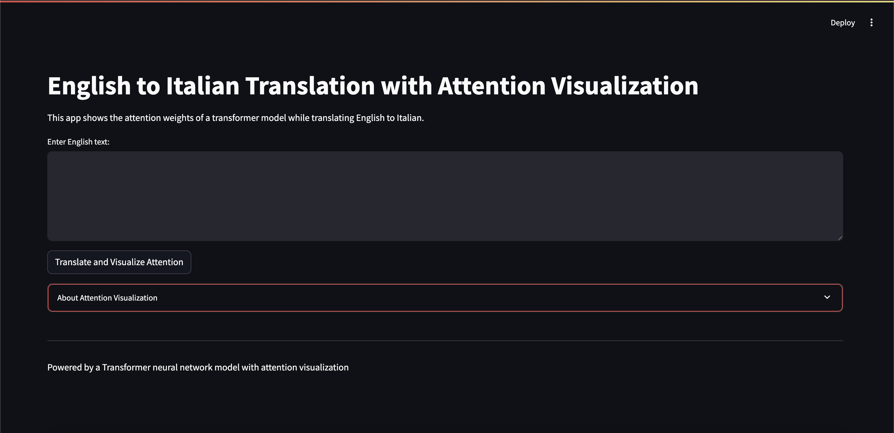

# 🧠 English to Italian Translation using Generative Transformers

This repository contains a custom-built **Generatively Pretrained Transformer (GPT)** model from scratch for **English to Italian machine translation**, based on the seminal paper _“Attention Is All You Need”_.

> 🚀 Built with PyTorch | Hugging Face | Google Colab | Streamlit

---



---

## 🖥️ Demo


## 📌 Features

- ✅ Fully custom implementation of Transformer architecture
- ⚙️ Encoder–Decoder blocks, Multi-Head Attention, Positional Encoding, Layer Normalization
- 🔍 Beam Search decoding for improved translation fluency
- 🌐 Attention heatmap visualizations (encoder, decoder, and cross-attention)
- 💻 Interactive Streamlit app for real-time translation and visualization
- ☁️ Trained on **NVIDIA A100 GPU** via Google Colab

---


## 🔧 Technologies Used

- **Frameworks**: PyTorch, Hugging Face Datasets
- **Training Tools**: Google Colab (A100), OneCycleLR scheduler, Label Smoothing
- **Visualization**: Matplotlib, Seaborn, Streamlit
- **Languages**: Python
- **Dataset**: [Helsinki-NLP / Opus Books (en-it)](https://huggingface.co/datasets/opus_books)

---

## 🧠 Model Architecture

- 6 Encoder + 6 Decoder layers
- 8 Attention Heads
- Positional Encoding (sinusoidal)
- Masked Multi-Head Attention for autoregressive decoding
- Feed-forward sublayers per token
- Residual connections + LayerNorm

---


## ⚙️ How to Run

### 🔁 Clone and Install

```bash
git clone https://github.com/your-username/english-to-italian-transformer.git
cd english-to-italian-transformer
pip install -r requirements.txt
```
### 🛠️  Train the Model

- If you have strong GPUs, then go ahead by running the `train.py` file or `Train.ipynb` notebook.
- An alternative to not having strong GPUs is to train the model using Google Colab's paid version which gives you access to Nvidia's A100 GPU along with 100 compute units. You can access the google colab notebooks in the `Colab Notebooks` directory where you can find the `Final_Training.ipynb` colab notebook.
- Your models will be saved in the `opus_books_weights` directory for all 30 epochs and the best model will be named with the highest BLEU score.

### 🗣️ Inference and Custom Inference

- For inference, you can either run the `Inference.ipynb` or run it on colab by running `Final_Inference.ipynb` in the `Colab Notebooks` directory. 
- For custom inference, you can either run the `Translate.py` file or the same colab notebook `Final_Inference.ipynb`.

### 📊 Attention Visualization

- You can either visualize the attention by running `attention_visualization.py` file or `attention.ipynb` notebook.
- For visualizing the attention on google colab, you can run `Attention_Visualization.ipynb` in the `Colab Notebooks` directory.

### 💻 Streamlit Application

- You can have an interactive interface for this translation model along with the visualizations by running the `app2.py` file which can be done directly in the terminal using:

```bash
streamlit run app2.py
```
